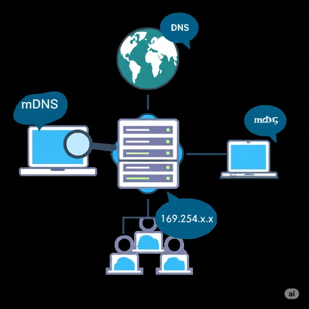

# 名稱解析 Name resolution

將主機、使用者、群組等實體的名稱解析為電腦能應用的數值

<https://gitlab.com/libre-knowledge/name-resolution>  
   

## 解決方案

以下列舉本主題相關的解決方案：

* [網域名稱系統 Domain Name System(DNS)](https://gitlab.com/libre-knowledge/dns)  
  保存域名和 IP 地址的一個對應資訊並提供解析器(resolver)查詢的分散式系統
* Multicast DNS(mDNS)  
  基於封包群播(multicast)技術方便同一線路連結的主機能夠透過主機名稱發現各自之服務的零配置(Zero-configuration)名稱解析系統

## 參考資料

以下列舉撰寫本主題內容時所參考的第三方資源：

* [Name resolution (computer systems) - Wikipedia](https://en.wikipedia.org/wiki/Name_resolution_(computer_systems))
* [Zero-configuration networking - Wikipedia](https://en.wikipedia.org/wiki/Zero-configuration_networking#Name_service_discovery)

---

本主題為[自由知識協作平台](https://libre-knowledge.github.io/)的一部分，除部份特別標註之經合理使用(fair use)原則使用的內容外允許公眾於授權範圍內自由使用

如有任何問題，歡迎於本主題的[議題追蹤系統](https://github.com/libre-knowledge/name-resolution/issues)創建新議題反饋
